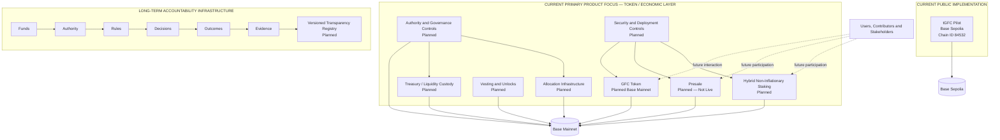

# GFC System Architecture Specification

**Document ID:** GFC-ARCH-001  
**Maturity:** Draft  
**Authority:** Normative  
**Version:** Unreleased  
**Implementation Status:** Pre-mainnet specification and pilot development  
**Primary Product Focus:** GFC Token / Economic Layer  
**Intended Production Network:** Base Mainnet  
**Production Chain ID:** 8453  
**Public Pilot Network:** Base Sepolia  
**Pilot Chain ID:** 84532  
**Last Updated:** 2026-08-30

---

## 1. Document Status

This document defines the intended high-level architecture of the Global Foundation Coin (GFC) infrastructure.

It is normative because it defines intended requirements, constraints, trust boundaries, component relationships, and prohibited behavior. Its maturity remains Draft, and requirements may change before the first versioned release.

GFC is currently in a **pre-mainnet development phase**.

The current primary product focus is the **GFC Token / Economic Layer**.

The broader long-term direction is an **Accountability Infrastructure** organized around the relationship:

**Funds → Authority → Rules → Decisions → Outcomes → Evidence**

At the time of publication:

- a public GFC pilot exists on **Base Sepolia**;
- the Base Sepolia pilot token is identified as **tGFC**;
- the pilot contract address is `0x7262Cca91938ede6bB6560F81104Aa410848e7f3`;
- the pilot contract is represented as source-verified;
- the pilot is a testnet deployment and has no Base Mainnet production authority;
- no production GFC token is deployed on Base Mainnet;
- no GFC presale is live;
- no production allocation, treasury, liquidity, staking, vesting, governance, or broader accountability infrastructure is represented as operational;
- no production contract or wallet address is official merely because it appears in a Draft document;
- no public presale launch date is established by this document;
- and no implementation should be described as conforming production infrastructure until it identifies an applicable versioned specification release and authenticated deployment record.

The presence of a component in this specification does not mean that the component has already been:

- implemented;
- tested;
- reviewed;
- audited;
- deployed;
- activated;
- made operational;
- or made available for production use.

The public Base Sepolia pilot MUST remain clearly distinguished from future Base Mainnet production systems.

The continuously changing `main` branch MUST NOT automatically be treated as the authoritative specification for a production deployment.

---

## 2. Purpose

This document defines the high-level architecture of the planned GFC token, allocation, presale, treasury, governance, staking, evidence, and transparency infrastructure.

Its purpose is to make the following matters explicit before implementation:

- which system components are intended to exist;
- what each component is responsible for;
- what each component must not be able to do;
- where technical authority begins and ends;
- where human judgment remains necessary;
- how token allocations are separated;
- how material fund flows are approved and documented;
- how on-chain and off-chain records interact;
- how transaction, fund-use, and impact claims are distinguished;
- how privileged roles are constrained;
- how implementation deviations are handled;
- which assumptions remain unresolved.

This document defines architectural boundaries. It does not define every contract interface, data structure, legal process, operational procedure, or user-interface detail.

Those matters may be defined in separate specifications.

---

## 3. Project Context

The current primary GFC product focus is the **GFC Token / Economic Layer**.

This includes the intended token-centered system and the supporting requirements necessary for later presale and Base Mainnet readiness, including:

1. fixed-supply token behavior;
2. allocation integrity;
3. vesting and unlock constraints;
4. economic-flow rules;
5. staking design;
6. presale mechanics and participant protections;
7. governance and authority constraints;
8. security requirements;
9. transparency requirements;
10. authenticated deployment and status records.

The current public Base Sepolia pilot demonstrates limited early technical execution. It does not establish production readiness or Mainnet deployment.

The longer-term GFC direction expands beyond the token toward broader **Accountability Infrastructure** connecting:

**Funds → Authority → Rules → Decisions → Outcomes → Evidence**

The token and economic layer, governance controls, transparency records, evidence systems, and later accountability components are related but distinct.

Their implementation and deployment status MUST be represented separately.

The existence of a blockchain token, verified contract, public wallet, or transaction history does not by itself establish:

- compliant authority;
- documented rules;
- valid decision processes;
- documented use of funds;
- successful outcomes;
- verified impact;
- or complete accountability.

The architecture therefore treats transaction visibility as one evidence source within a wider accountability model rather than as a substitute for governance, evidence, or outcome verification.

---

## 4. Normative Language

The terms **MUST**, **MUST NOT**, **REQUIRED**, **SHALL**, **SHALL NOT**, **SHOULD**, **SHOULD NOT**, **RECOMMENDED**, **NOT RECOMMENDED**, **MAY**, and **OPTIONAL** express requirement levels.

These terms are normative only when:

- they appear in uppercase;
- they occur within a document declaring `Authority: Normative`;
- and the document version is applicable to the implementation being evaluated.

Because this document is currently Draft, its normative requirements describe the intended architecture but remain subject to formal review and versioned release.

---

## 5. Scope

This specification covers:

- intended deployment on Base;
- GFC token architecture;
- fixed token supply;
- transaction-fee boundaries;
- token allocation structure;
- presale architecture;
- long-term locks and vesting;
- treasury and reserve separation;
- staking and participation boundaries;
- governance and administrative authority;
- contract upgrade and pause authority;
- public wallet and contract disclosure;
- transparency infrastructure;
- evidence classification;
- transaction verification;
- fund-use verification;
- outcome and impact evaluation;
- off-chain documentation;
- protected information;
- operational roles;
- trust assumptions;
- security boundaries;
- incident and migration requirements;
- specification and implementation conformance.

---

## 6. Out of Scope

This document does not independently define:

- final smart-contract source code;
- exact contract interfaces;
- final storage layouts;
- exact multisig signer identities;
- exact multisig thresholds;
- exact timelock durations;
- production addresses for ETH, USDC, or DAI used by a future presale;
- final exchange-rate or oracle methodology;
- the exact failed-presale settlement mechanism required when GFC has already been distributed immediately;
- final staking reward parameters;
- final staking reward source;
- final governance voting mechanisms;
- final legal or organizational structure;
- regulatory eligibility requirements;
- jurisdiction-specific participation restrictions;
- tax treatment;
- accounting treatment;
- final evidence-review procedures;
- final impact-measurement methodology;
- final privacy and retention policies;
- final production deployment addresses;
- final audit providers;
- or final portal and registry implementation.

The current Draft presale direction does identify **ETH, USDC, and DAI on Base** as intended payment assets and **immediate token distribution** as the intended delivery model. Their production addresses, valuation rules, and implementation behavior remain subject to the applicable presale specification.

These matters must be resolved in dedicated specifications, operating policies, legal documentation, or released implementation records before the relevant system becomes operational.

---

## 7. Architectural Principles

The GFC architecture follows the principles below.

### 7.1 Explicit authority over implicit power

Every material administrative or governance capability MUST be identifiable.

No material authority may exist solely because:

- a private key controls a wallet;
- a deployer retained an undocumented role;
- a proxy administrator exists;
- a backend service can alter user outcomes;
- a front end hides privileged functionality;
- or an operational convention is assumed but not documented.

### 7.2 Constraints over discretion

Where a commitment can reasonably be enforced through code, the implementation SHOULD prefer explicit technical constraints over informal promises.

Where human judgment remains necessary, its scope MUST be documented.

### 7.3 Verifiability over narrative claims

Public claims SHOULD be supported by independently reviewable evidence.

Narrative descriptions MUST NOT be presented as equivalent to:

- on-chain execution;
- cryptographic anchoring;
- independently reviewed documentation;
- or verified outcomes.

### 7.4 Separation of execution, governance, and impact

The system MUST distinguish between:

- what technically executed;
- who approved or controlled the execution;
- why the execution occurred;
- whether the documented purpose was fulfilled;
- and whether a meaningful result followed.

### 7.5 Bounded automation

Automation SHOULD be used where it improves:

- predictability;
- consistency;
- enforceability;
- auditability;
- or protection against unilateral action.

Automation MUST NOT be used to imply that human responsibility has disappeared where contextual decisions remain necessary.

### 7.6 Privacy-aware transparency

Transparency does not require the unrestricted publication of:

- personal data;
- beneficiary identities;
- confidential contracts;
- sensitive security information;
- or legally protected records.

The architecture MUST support verifiability without unnecessary exposure of protected information.

### 7.7 Long-term commitments over short-term flexibility

Long-term allocation, vesting, and lock commitments MUST NOT contain hidden or easily accessible bypasses that defeat their stated purpose.

### 7.8 No retrospective normalization of deviations

A specification MUST NOT be changed retrospectively merely to make a non-conforming implementation appear conforming.

Material deviations must be disclosed and evaluated.

### 7.9 Accurate implementation status

GFC communications MUST distinguish between:

- Draft;
- Proposed;
- Planned;
- Specified;
- Implemented;
- Tested;
- Pilot;
- Reviewed;
- Audited;
- Deployed;
- Live;
- Active;
- Operational;
- Independently Verified;
- and Not Deployed.

These states MUST NOT be presented as interchangeable.

A testnet pilot MUST NOT be represented as a Mainnet production deployment.

---

## 8. Intended Deployment Environment

### 8.1 Intended production network

The intended initial production execution network is Base Mainnet.

- **Network:** Base Mainnet
- **Chain ID:** 8453
- **Token standard:** ERC-20-compatible
- **Token decimals:** 18
- **Production GFC status:** Not deployed

Any future production deployment remains subject to:

- completed implementation;
- defined testing;
- technical review;
- security review;
- operational review;
- applicable legal and regulatory review;
- authenticated release records;
- and final release approval.

### 8.2 Current public pilot

A separate public GFC pilot exists on Base Sepolia.

- **Environment:** Public testnet pilot
- **Network:** Base Sepolia
- **Chain ID:** 84532
- **Pilot token:** tGFC
- **Contract address:** `0x7262Cca91938ede6bB6560F81104Aa410848e7f3`
- **Source verification:** Verified
- **Production authority:** None

The pilot is evidence of limited early technical execution only.

It MUST NOT be interpreted as:

- the production GFC token;
- a Base Mainnet deployment;
- a live presale;
- a production allocation system;
- a production staking system;
- production treasury infrastructure;
- production governance infrastructure;
- or proof that future Mainnet code, parameters, addresses, roles, or authority structures will be identical.

### 8.3 No separate GFC blockchain at initial launch

A separate GFC Layer 1, Layer 2, application-specific rollup, or independent consensus network is not part of the intended initial production architecture.

The intended initial production system uses Base Mainnet as its execution and public settlement layer.

Later Base-aligned appchain, rollup, or other chain-specific development MAY be evaluated through future specifications and roadmap decisions.

No such later system is committed, deployed, or production-authoritative through this architecture document.

### 8.4 Cross-chain systems

Bridges, wrapped GFC representations, and cross-chain deployments are outside the initial production architecture unless introduced through a separate versioned specification.

No bridged, wrapped, copied, or third-party representation may be described as official without:

- explicit release approval;
- authenticated publication;
- technical documentation;
- contract verification;
- risk disclosure;
- and a defined relationship to the canonical Base Mainnet deployment.

---

## 9. High-Level Architectural Model

The architecture has two different views that MUST NOT be confused:

1. the **current product architecture**, centered on the GFC Token / Economic Layer; and
2. the **long-term accountability architecture**, which expands the system beyond the token.

### 9.1 Current product architecture

The current primary product architecture includes:

- GFC token behavior;
- token allocations;
- vesting and unlocks;
- economic flows;
- staking;
- presale mechanics;
- custody;
- authority controls;
- security constraints;
- transparency requirements;
- and deployment authentication.

These components support the objective of preparing the Token / Economic Layer for later production readiness.

### 9.2 Long-term accountability architecture

The broader architectural direction is:

**Funds → Authority → Rules → Decisions → Outcomes → Evidence**

Each stage represents a distinct accountability question.

The architecture SHOULD make it possible, where applicable, to reconstruct:

- what value moved;
- who had authority;
- which rules applied;
- what decision was made;
- what outcome followed;
- and what evidence supports the record.

### 9.3 Architectural views

For design and review purposes, components may additionally be grouped into three interacting views:

1. Technology
2. Governance
3. Impact and Evidence

These views are analytical groupings.

They do not imply that all three are equally mature, equally deployed, or equal current product priorities.

The current public implementation remains limited to the identified Base Sepolia pilot.

---

## 10. Technology Layer

The Technology Layer contains the technical components of the current Token / Economic Layer and later accountability infrastructure.

Planned production components MUST remain distinguished from the existing Base Sepolia pilot.

The Technology Layer includes:

- the GFC token contract;
- presale contracts or mechanisms;
- allocation contracts;
- treasury and reserve custody mechanisms;
- vesting contracts;
- lock contracts;
- staking contracts;
- governance execution contracts;
- cryptographic anchoring mechanisms;
- public on-chain records;
- deployment and verification records;
- monitoring infrastructure;
- and public data interfaces.

This layer determines what technically executes.

Technology can enforce defined rules and produce verifiable records.

Technology cannot independently determine:

- whether a real-world invoice is legitimate;
- whether a service was actually delivered;
- whether a beneficiary received meaningful support;
- whether an intervention was effective;
- or whether an impact claim is methodologically sound.

---

## 11. Governance Layer

The Governance Layer defines authority and decision constraints supporting both the current Token / Economic Layer and later accountability infrastructure.

The Governance Layer includes:

- role definitions;
- approval requirements;
- signer responsibilities;
- contract administration;
- parameter-change authority;
- pause authority;
- upgrade authority;
- treasury approvals;
- reserve movements;
- emergency procedures;
- incident handling;
- migration authority;
- evidence-review responsibilities;
- and public disclosure obligations.

This layer determines:

- who may act;
- what actions they may perform;
- which approvals are required;
- what limitations apply;
- and how those actions are documented.

Governance participation MUST NOT be presented as complete decentralization where material human or administrative authority continues to exist.

---

## 12. Impact and Evidence Layer

The Impact and Evidence Layer represents the longer-term evidence and outcome side of the accountability architecture. It is not represented as a complete production system today.

The Impact and Evidence Layer includes:

- intended-use documentation;
- approval records;
- transaction-to-purpose reconciliation;
- invoices and receipts;
- agreements;
- delivery evidence;
- protected records;
- cryptographic document anchors;
- outcome records;
- impact assessments;
- methodology disclosures;
- uncertainty disclosures;
- and independent reviews where applicable.

This layer determines which claims can be supported beyond the existence of a blockchain transaction.

---

## 13. Verification Model

GFC separates claims according to what they actually establish.

### 13.1 Transaction verification

**Question:**

Did the funds move as stated?

Relevant evidence may include:

- transaction hashes;
- sender and recipient addresses;
- token transfer events;
- timestamps;
- amounts;
- contract events;
- block confirmations;
- and verified contract state.

Transaction verification can establish that a recorded on-chain action occurred.

It does not by itself establish:

- the purpose of the payment;
- the legitimacy of the recipient;
- compliance with an approval process;
- delivery of goods or services;
- the quality of the funded activity;
- a resulting outcome;
- or impact.

### 13.2 Use-of-funds verification

**Question:**

Were the funds used for the documented purpose?

Relevant evidence may include:

- invoices;
- receipts;
- agreements;
- approval records;
- delivery records;
- procurement documentation;
- payment reconciliation;
- recipient confirmations;
- signed attestations;
- cryptographically anchored documents;
- and protected supporting records.

A wallet label or transaction description MUST NOT be treated as sufficient proof of use.

### 13.3 Output verification

**Question:**

Was the documented activity, deliverable, or service produced?

Relevant evidence may include:

- delivery records;
- completion evidence;
- project records;
- measurements;
- attestations;
- and independent confirmation where appropriate.

Output verification does not automatically establish a broader outcome.

### 13.4 Outcome verification

**Question:**

Did the documented activity create the claimed result?

Relevant evidence may include:

- follow-up data;
- defined indicators;
- measurement methodology;
- comparison data;
- baseline information;
- and independent review.

An outcome claim requires evidence appropriate to the claimed change.

### 13.5 Impact verification

**Question:**

Can a broader meaningful effect be supported by appropriate evidence and methodology?

Relevant evidence may include:

- outcome data;
- attribution analysis;
- longitudinal evidence;
- methodology documentation;
- independent evaluation;
- limitations;
- confidence assessments;
- and uncertainty disclosures.

A completed payment does not prove a positive result.

A completed activity does not necessarily prove an outcome.

A documented outcome does not automatically establish broader impact.

### 13.6 Core distinctions

The following distinctions are foundational:

> TRANSACTION VERIFIED does not equal USE OF FUNDS VERIFIED.

> USE OF FUNDS VERIFIED does not equal OUTCOME VERIFIED.

> OUTCOME VERIFIED does not automatically equal IMPACT VERIFIED.

Different claims require different evidence.

---

## 14. Evidence Disclosure Levels

Evidence may be handled through three principal disclosure levels.

### 14.1 Public on-chain

Public on-chain evidence may include:

- verified contract addresses;
- token transfers;
- treasury movements;
- allocation balances;
- vesting state;
- lock state;
- governance execution;
- cryptographic commitments;
- and relevant contract events.

On-chain evidence is publicly visible but remains limited to the information encoded on-chain.

### 14.2 Cryptographically anchored

Cryptographically anchored evidence consists of records whose integrity is linked to a public:

- hash;
- signature;
- timestamp;
- Merkle root;
- content commitment;
- or equivalent cryptographic reference.

Anchoring may demonstrate that a specific record existed in a specific form at or before a particular point.

Anchoring does not by itself prove:

- factual accuracy;
- legal validity;
- authenticity of the original source;
- correctness of the underlying statement;
- or satisfactory performance.

### 14.3 Protected off-chain

Protected off-chain evidence may include:

- personal data;
- beneficiary information;
- confidential agreements;
- sensitive invoices;
- banking records;
- identity documents;
- commercially sensitive information;
- security-sensitive information;
- internal control records;
- and legally protected documentation.

Protected records MUST be subject to:

- access control;
- integrity protection;
- retention rules;
- documented review procedures;
- and disclosure limitations.

Protected information MUST NOT be placed permanently on a public blockchain unless publication is lawful, necessary, proportionate, and explicitly approved.

---

## 15. Evidence Provenance

The transparency system MUST distinguish between different evidence sources.

At minimum, information SHOULD be classified as one of the following:

- directly verified on-chain;
- project-authored;
- externally supplied;
- cryptographically anchored;
- reviewed by an identified internal role;
- reviewed by an identified external party;
- independently verified;
- disputed;
- superseded;
- or unavailable.

The interface MUST NOT visually or linguistically present all evidence classes as equally reliable.

The absence of public documentation MUST NOT automatically be interpreted as evidence that no protected documentation exists.

Conversely, a statement that protected documentation exists MUST NOT automatically be treated as independent verification.

---

## 16. GFC Token Architecture

### 16.1 Token type

GFC is intended to be implemented as an ERC-20-compatible token on Base.

### 16.2 Total supply

The intended total supply is:

**1,000,000,000 GFC**

The supply uses 18 decimal places.

### 16.3 Fixed-supply requirement

The intended supply model is non-inflationary.

After the approved initial supply has been created, the production implementation MUST NOT permit discretionary creation of additional GFC.

The implementation MUST NOT contain:

- an undocumented mint function;
- an unrestricted minter role;
- a hidden supply expansion mechanism;
- or an upgrade path that can silently introduce discretionary inflation.

Where deployment requires temporary mint authority, that authority MUST be:

- limited to the initial allocation process;
- documented;
- publicly verifiable;
- and permanently disabled or removed after completion.

### 16.4 Burning

A burn mechanism is not required by this architecture.

Where burning is implemented, it MUST:

- reduce circulating or total supply;
- not permit later reminting beyond the original fixed maximum;
- not create misleading scarcity claims;
- and be documented in the applicable token specification.

### 16.5 Transfer authority

The token contract MUST NOT contain undocumented authority to:

- confiscate user balances;
- arbitrarily transfer user tokens;
- silently freeze individual holders;
- alter balances outside documented mechanisms;
- or bypass normal transfer rules.

Any compliance, denylist, allowlist, pause, or transfer-restriction functionality considered for implementation MUST be explicitly specified before deployment.

### 16.6 Governance relationship

Token ownership MUST NOT automatically grant unrestricted control over:

- treasury assets;
- Impact Vault assets;
- protected evidence;
- legal entities;
- operational wallets;
- contract upgrades;
- emergency controls;
- or impact determinations.

The token MAY support defined staking, participation, community, or governance-related utility.

Any such rights MUST be explicitly limited and documented.

---

## 17. Transaction-Fee Architecture

### 17.1 Intended fee model

The current intended transaction-fee model is:

- **Buy fee:** 0%
- **Sell fee:** 1%

### 17.2 Fee classification

The exact technical classification of a transfer as a buy, sell, or ordinary transfer MUST be defined before implementation.

The implementation MUST document:

- which liquidity pools are recognized;
- how buy transactions are identified;
- how sell transactions are identified;
- how ordinary wallet transfers are treated;
- how liquidity additions and removals are treated;
- how routers and aggregators are treated;
- how exemptions are handled;
- and how new trading venues may be added.

### 17.3 Fee mutability

The production implementation MUST disclose whether the sell fee is:

- immutable;
- reducible;
- configurable within a fixed range;
- or upgradeable.

No role may possess undocumented authority to increase the fee.

Any permitted maximum MUST be technically enforced.

Unless a later released specification explicitly provides otherwise, the intended production sell fee MUST NOT exceed 1%.

### 17.4 Fee destination

The final fee destination and allocation logic remain unresolved at the architecture level.

Before deployment, the applicable token specification MUST define:

- recipient contract or wallet;
- allocation purpose;
- distribution frequency;
- custody model;
- administrative authority;
- failure behavior;
- public reporting;
- and whether the destination can be changed.

Fee revenue MUST NOT be represented as impact funding unless its actual allocation and use are separately documented.

### 17.5 Exemptions

Fee exemptions, where permitted, MUST be:

- technically identifiable;
- limited;
- publicly documented where disclosure does not create a security risk;
- and subject to defined governance controls.

An exemption mechanism MUST NOT create an undisclosed privileged trading class.

---

## 18. Token Allocation Architecture

The intended allocation of the total GFC supply is:

| Allocation | Percentage | Token Amount |
|---|---:|---:|
| Impact Vault | 25% | 250,000,000 GFC |
| Guardian Growth | 20% | 200,000,000 GFC |
| Presale Allocation | 15% | 150,000,000 GFC |
| Treasury Reserve | 15% | 150,000,000 GFC |
| Liquidity Reserve | 15% | 150,000,000 GFC |
| Ecosystem | 5% | 50,000,000 GFC |
| Core Team | 5% | 50,000,000 GFC |
| **Total** | **100%** | **1,000,000,000 GFC** |

### 18.1 Allocation integrity

The sum of all initial allocation amounts MUST equal the fixed total supply.

The production deployment process MUST publish:

- recipient addresses;
- contract addresses;
- transaction hashes;
- allocation amounts;
- custody type;
- lock or vesting status;
- and any unresolved migration or administrative authority.

### 18.2 Allocation labels

Allocation names describe intended roles.

An allocation label does not independently prove:

- lawful use;
- correct use;
- approved use;
- delivery;
- or impact.

Actual movements and use MUST be documented separately.

### 18.3 Separation

Material allocations SHOULD be held in separate wallets or contracts with separately defined authority.

Combining materially different allocations in one unrestricted wallet is NOT RECOMMENDED.

Where allocations share custody infrastructure, their accounting and authority boundaries MUST remain independently verifiable.

---

## 19. Impact Vault

### 19.1 Allocation

The Impact Vault is intended to receive:

- **25% of total supply**
- **250,000,000 GFC**

### 19.2 Lock period

The intended lock period is:

- **50 years**

The exact lock start, release schedule, timestamp logic, and terminal destination MUST be defined before deployment.

### 19.3 Early-release prohibition

The implementation MUST NOT permit:

- unilateral early release;
- administrative reduction of the lock period;
- hidden withdrawal authority;
- proxy upgrades that bypass the lock;
- emergency functions that operate as an early unlock;
- or migration into a less restrictive structure.

### 19.4 Lock extension

A lock extension MAY be permitted where it:

- preserves or strengthens the original commitment;
- cannot be used to accelerate release;
- is publicly documented;
- and follows the applicable governance process.

### 19.5 Migration

Any migration mechanism MUST preserve at least:

- the remaining locked amount;
- the remaining lock duration;
- the economic restriction;
- and the original allocation purpose.

Migration MUST NOT function as a disguised early release.

### 19.6 Impact claims

The existence of an Impact Vault does not prove future impact.

Impact claims require separate evidence concerning:

- actual release;
- approved purpose;
- use of funds;
- delivered outputs;
- achieved outcomes;
- and evaluation limitations.

---

## 20. Core Team Vesting

### 20.1 Allocation

The Core Team allocation is intended to receive:

- **5% of total supply**
- **50,000,000 GFC**

### 20.2 Vesting period

The intended vesting period is:

- **19 years**
- **linear vesting**

### 20.3 Vesting requirements

The implementation MUST NOT permit:

- unilateral acceleration;
- discretionary early release;
- hidden administrative withdrawal;
- replacement with a shorter schedule;
- or migration that weakens the remaining vesting commitment.

### 20.4 Required details before deployment

The final vesting specification MUST define:

- vesting start;
- cliff, if any;
- release interval;
- calculation method;
- beneficiary structure;
- reassignment rules;
- succession rules;
- revocation rules;
- treatment of unclaimed tokens;
- migration process;
- and contract upgradeability.

### 20.5 Public interpretation

Vesting MUST NOT be described as fully locked where vested amounts have already become claimable.

The public interface SHOULD distinguish between:

- total allocation;
- unvested amount;
- vested but unclaimed amount;
- and claimed amount.

---

## 21. Guardian Growth

The Guardian Growth allocation is intended to receive:

- **20% of total supply**
- **200,000,000 GFC**

Its exact mandate, custody, release logic, approval process, spending categories, and reporting requirements remain subject to a dedicated specification.

Before production use, the applicable specification MUST define:

- permitted purposes;
- prohibited purposes;
- approval authority;
- transaction thresholds;
- release schedule, if any;
- signer or contract structure;
- conflict-of-interest controls;
- documentation requirements;
- and public reporting.

The term “Guardian” MUST NOT be interpreted as proof of independent oversight unless such oversight actually exists and is documented.

---

## 22. Presale Allocation

The Presale Allocation is intended to receive:

- **15% of total supply**
- **150,000,000 GFC**

The presale MUST NOT distribute more than the designated allocation.

The presale MUST NOT create additional GFC supply.

Unused allocation treatment MUST be defined before launch.

Potential outcomes may include:

- retention under a specified lock;
- reassignment through a published governance process;
- transfer to another predefined allocation;
- or permanent removal from circulation.

No unused-token treatment may be changed retrospectively without disclosure.

---

## 23. Treasury Reserve

The Treasury Reserve is intended to receive:

- **15% of total supply**
- **150,000,000 GFC**

The Treasury Reserve exists as a strategic reserve and MUST NOT be treated as unrestricted discretionary inventory.

Before production use, the treasury specification MUST define:

- permitted uses;
- prohibited uses;
- custody structure;
- signer threshold;
- proposal requirements;
- transaction limits;
- emergency authority;
- reporting obligations;
- and migration procedures.

Treasury movements MUST be publicly traceable on-chain.

On-chain traceability does not replace use-of-funds documentation.

---

## 24. Liquidity Reserve

The Liquidity Reserve is intended to receive:

- **15% of total supply**
- **150,000,000 GFC**

Before liquidity is deployed, the applicable specification MUST define:

- supported venues;
- initial liquidity amount;
- pairing assets;
- price-setting process;
- liquidity-provider token ownership;
- liquidity locks, if any;
- liquidity withdrawal authority;
- rebalancing authority;
- market-making arrangements;
- fee collection;
- and reporting.

Liquidity provisioning MUST NOT be described as permanently locked unless the relevant position is technically and verifiably locked.

Any authority to remove liquidity MUST be disclosed.

---

## 25. Ecosystem

The Ecosystem allocation is intended to receive:

- **5% of total supply**
- **50,000,000 GFC**

Before production use, the applicable specification MUST define:

- eligible ecosystem activities;
- grant or incentive rules;
- recipient selection;
- approval authority;
- distribution limits;
- vesting or milestone conditions;
- conflict-of-interest rules;
- and reporting requirements.

Marketing expenditure, technical development, partnerships, grants, and community incentives MUST be distinguished where they are funded through this allocation.

---

## 26. Presale Architecture

### 26.1 Current status

No GFC presale is currently live.

No public start date is established by this specification.

### 26.2 Current Draft parameters

The current intended presale parameters are:

- **Reference price:** €0.05 per GFC
- **Intended duration:** 8 weeks
- **Soft cap:** €250,000
- **Independent monetary hard cap:** None intended
- **Token allocation:** Maximum 150,000,000 GFC
- **Intended payment assets:** ETH, USDC, and DAI on Base
- **Token delivery:** Immediate distribution
- **Failure condition:** Refund if the soft cap is not reached
- **Material sale logic:** Intended to be immutable after production deployment

The finite Presale Allocation creates an absolute token-distribution limit even though no separate monetary hard cap is intended.

These parameters remain Draft until incorporated into an applicable versioned presale specification and production implementation.

### 26.3 Pricing and valuation

Because the reference price is euro-denominated while intended payment assets include ETH, USDC, and DAI, the presale specification MUST define:

- authenticated production asset addresses;
- exchange-rate source;
- rate timestamp;
- rate update frequency;
- rounding;
- stale-price limits;
- oracle or pricing-source failure behavior;
- decimal handling;
- and dispute or correction treatment where applicable.

Pricing MUST be deterministic and reviewable.

### 26.4 Immediate token distribution

The current intended delivery model is **immediate distribution**.

A successful purchase is intended to transfer the corresponding GFC amount to the participant as part of, or immediately following, the accepted purchase transaction.

The production specification MUST define:

- exact delivery semantics;
- transaction atomicity;
- failure behavior;
- rounding behavior;
- allocation exhaustion behavior;
- and accounting records.

The system MUST NOT describe a deferred claim phase as the current intended delivery model unless the applicable specification is formally changed.

### 26.5 Refund invariant and failed-sale settlement

The presale is intended to provide refunds if the applicable soft-cap success condition is not satisfied.

Because the current Draft also uses immediate GFC distribution, the production presale specification MUST explicitly define how failed-sale refunds interact with GFC already distributed to participants.

This architecture does **not** prescribe an unapproved return, clawback, burn, escrow, or other settlement mechanism.

Before the presale specification can become Stable, it MUST define a mechanism that:

- preserves enforceable refund rights;
- defines the status of GFC already distributed;
- prevents contradictory token and contribution accounting;
- prevents project access to refundable contribution assets;
- remains technically enforceable;
- and is accurately represented to participants before purchase.

No production presale may launch while this interaction remains ambiguous.

### 26.6 Contribution custody

Accepted contribution assets MUST NOT become unrestricted project proceeds while applicable refund rights remain active.

The implementation MUST preserve the ability to honor valid refunds under the finalized settlement model.

The final specification MUST define:

- contribution custody;
- when proceeds become withdrawable;
- who may withdraw;
- required approvals;
- destination addresses;
- treatment of payment-asset volatility;
- refund timing;
- partial-failure behavior;
- and treatment of unresolved or unclaimed refunds where applicable.

### 26.7 Soft-cap failure

If the soft cap is not reached under the finalized presale rules:

- eligible participants MUST have the defined refund right;
- the refund mechanism MUST be technically and operationally documented;
- project operators MUST NOT redirect refundable contribution assets for another purpose;
- the treatment of already distributed GFC MUST follow the predeclared settlement mechanism;
- and failed-sale Presale Allocation accounting MUST remain reconcilable.

### 26.8 Immutability and administrative boundaries

The current intended production presale design is immutable with respect to material participant-facing sale rules.

After production deployment and activation, the system MUST NOT provide an undisclosed or upgrade-based mechanism to alter:

- reference price;
- duration;
- soft cap;
- Presale Allocation;
- supported payment assets;
- token-delivery semantics;
- refund rights;
- participant purchase records;
- or withdrawal conditions.

Any pause or emergency capability, if included, MUST be separately specified and MUST NOT function as a hidden rule-changing mechanism.

### 26.9 Off-chain contributions

Off-chain contributions are not authorized by this architecture unless a later applicable specification explicitly introduces them.

If introduced later, they MUST NOT bypass:

- pricing rules;
- allocation limits;
- eligibility rules;
- refund rights;
- accounting requirements;
- or reporting obligations.

### 26.10 Legal and eligibility controls

Participation requirements, identity checks, geographic restrictions, sanctions controls, and legal eligibility are outside this architecture document but MUST be resolved before production launch.

Technical implementation MUST NOT be presented as replacing legal compliance.

---

## 27. Treasury and Custody Architecture

### 27.1 Role-specific custody

Each material wallet or contract MUST have a defined purpose.

For each material production address, GFC MUST document:

- address;
- network;
- role;
- allocation;
- custody model;
- signer model;
- approval threshold;
- administrative authority;
- permitted actions;
- prohibited actions;
- upgradeability;
- recovery mechanism;
- and reporting obligations.

### 27.2 Single-key risk

Material production assets MUST NOT depend entirely on a single private key.

Lower-value operational wallets MAY use narrower control structures only where:

- maximum exposure is limited;
- purpose is narrow;
- authority is documented;
- monitoring exists;
- and loss does not compromise core allocations.

### 27.3 Multisig

Where multisig custody is used, the final configuration MUST define:

- number of signers;
- approval threshold;
- signer role categories;
- signer replacement;
- emergency procedures;
- hardware-wallet requirements;
- transaction review;
- and public disclosure level.

A multisig does not by itself eliminate centralized control.

Signer independence and approval procedures matter in addition to the numeric threshold.

### 27.4 Separation of duties

The architecture SHOULD separate, where reasonably possible:

- transaction proposal;
- transaction approval;
- transaction execution;
- evidence submission;
- evidence review;
- accounting reconciliation;
- and impact evaluation.

Where one person or entity holds multiple roles, that concentration MUST be disclosed.

### 27.5 Wallet labels

A wallet label MUST NOT be treated as a technical restriction.

A wallet named “Impact,” “Treasury,” “Foundation,” or “Liquidity” remains unrestricted unless technical or governance controls actually constrain it.

---

## 28. Governance Architecture

### 28.1 Governance purpose

Governance exists to define and constrain decision-making.

It MUST NOT serve as a vague justification for unlimited discretionary authority.

### 28.2 Governance control surface

The complete governance control surface MUST include authority relating to:

- contract deployment;
- contract upgrades;
- proxy administration;
- pause functions;
- unpause functions;
- fee parameters;
- fee exemptions;
- recognized liquidity pools;
- presale configuration;
- allocation movements;
- treasury transfers;
- liquidity deployment;
- signer replacement;
- role assignment;
- evidence-policy changes;
- emergency migration;
- incident response;
- and system deprecation.

### 28.3 Authority registry

Every production deployment MUST publish an authority registry identifying:

- privileged role;
- controlling address or contract;
- permitted actions;
- affected components;
- approval requirements;
- timelock, if any;
- revocation method;
- and current status.

### 28.4 Governance participation

GFC may introduce token-based, staking-based, community-based, expert-based, or hybrid participation.

Participation rights MUST be distinguished from execution authority.

A vote MAY be:

- advisory;
- proposal-forming;
- approval-requiring;
- veto-capable;
- or directly executable.

The exact legal and technical effect MUST be disclosed.

### 28.5 No unrestricted token governance

Token ownership or staking MUST NOT automatically grant unrestricted control over:

- protected personal information;
- legal obligations;
- security incident details;
- beneficiary decisions;
- regulated activities;
- custody keys;
- or arbitrary treasury withdrawal.

### 28.6 Governance capture

The final governance specification MUST address:

- concentration of voting power;
- delegated voting;
- sybil resistance;
- conflicts of interest;
- quorum;
- proposal thresholds;
- execution delay;
- emergency override;
- and capture resistance.

### 28.7 Governance transparency

Material governance actions SHOULD produce:

- a proposal record;
- rationale;
- affected components;
- approval record;
- execution record;
- responsible roles;
- and post-execution status.

Confidential information may be withheld where justified, but the existence and nature of the decision SHOULD remain visible where possible.

---

## 29. Administrative Roles

Potential administrative role categories include:

- deployer;
- token administrator;
- proxy administrator;
- pauser;
- fee administrator;
- presale administrator;
- treasury proposer;
- treasury signer;
- vesting administrator;
- staking administrator;
- evidence custodian;
- evidence reviewer;
- portal operator;
- security responder;
- and migration administrator.

The existence of a potential role category does not mean that the role will necessarily be implemented.

Before production deployment, each actual role MUST be:

- justified;
- narrowly scoped;
- technically documented;
- assigned;
- monitored;
- and removable or replaceable through a defined process.

Unused privileged roles SHOULD be removed.

---

## 30. Upgradeability

### 30.1 Component classification

Every production component MUST declare whether it is:

- immutable;
- configurable;
- pausable;
- upgradeable;
- replaceable through migration;
- or permanently retired.

### 30.2 Upgrade disclosure

Where a component is upgradeable, the deployment record MUST disclose:

- proxy address;
- implementation address;
- proxy type;
- administrator;
- upgrade approval threshold;
- timelock;
- emergency exceptions;
- storage compatibility process;
- and public notification process.

### 30.3 Upgrade restrictions

An upgrade MUST NOT silently introduce:

- additional mint authority;
- weaker locks;
- accelerated vesting;
- higher fees;
- balance confiscation;
- unrestricted transfer blocking;
- reduced refund rights;
- broader treasury authority;
- or weaker approval thresholds.

Any material change requires an applicable versioned specification update.

### 30.4 Immutable claims

A component MUST NOT be described as immutable if:

- it uses an upgradeable proxy;
- it can be replaced through an administrator-controlled router;
- an external registry can redirect execution;
- or an administrative role can materially change its behavior.

---

## 31. Pause and Emergency Controls

### 31.1 Purpose

Pause functionality MAY be used to reduce harm during:

- active exploitation;
- critical vulnerabilities;
- compromised keys;
- severe oracle failure;
- or other defined emergencies.

### 31.2 Scope

A pause mechanism MUST define:

- affected functions;
- unaffected functions;
- authorized role;
- approval threshold;
- maximum duration, if applicable;
- unpause process;
- and public disclosure obligations.

### 31.3 Limitations

Pause authority MUST NOT function as undocumented authority to:

- seize balances;
- redirect allocations;
- cancel valid claims;
- remove refund rights;
- or permanently suspend users without defined rules.

### 31.4 Emergency actions

Emergency actions SHOULD produce:

- an on-chain event where technically possible;
- a public incident notice;
- an explanation of scope;
- responsible authority;
- affected users or components;
- remediation status;
- and follow-up review.

Security-sensitive details MAY be delayed until disclosure no longer increases risk.

---

## 32. Staking Architecture

### 32.1 Current intended model

The current Draft direction is a **hybrid, non-inflationary staking model**.

The model MAY combine:

- token rewards;
- governance-related participation;
- community-related benefits;
- or other explicitly specified utility.

No production GFC staking system is currently operational.

### 32.2 Non-inflationary requirement

Staking MUST NOT increase the fixed GFC total supply.

Any token-denominated staking rewards MUST originate from:

- GFC already included within the fixed supply;
- a predefined allocation;
- or another explicitly specified non-minting economic source.

A staking design MUST NOT introduce discretionary minting through upgrades, reward contracts, or replacement systems.

### 32.3 No guaranteed return

Staking MUST NOT be presented as providing guaranteed profit or guaranteed yield.

Any displayed reward rate, APR, APY, or estimate MUST identify:

- calculation basis;
- reward source;
- duration;
- assumptions;
- variability;
- and relevant risks.

### 32.4 Reward sustainability

Before implementation, the staking specification MUST define:

- reward source;
- reward allocation;
- emission or distribution duration;
- maximum distribution;
- staking period;
- lock conditions;
- early-exit conditions;
- reward calculation;
- governance or participation rights;
- and long-term sustainability.

### 32.5 Staking authority

Staking MUST NOT automatically grant:

- custody authority;
- unrestricted treasury control;
- contract-upgrade authority;
- access to protected evidence;
- or authority to define an outcome or impact claim as verified.

### 32.6 Contract risks

The public interface MUST disclose relevant staking risks, including:

- smart-contract risk;
- lock-up risk where applicable;
- reward variability;
- liquidity risk;
- governance risk;
- and migration risk.

---

## 33. Transparency Infrastructure

### 33.1 Status and purpose

The broader production transparency infrastructure is planned and is not represented as fully deployed today.

The intended infrastructure is designed to make funds, authority, rules, decisions, claims, evidence, corrections, and historical status more reviewable over time.

It may aggregate:

- Base transaction data;
- verified contract data;
- token allocations;
- wallet balances;
- treasury movements;
- lock and vesting state;
- governance approvals;
- cryptographic evidence anchors;
- use-of-funds records;
- protected-document references;
- outcome information;
- and impact evaluations.

### 33.2 Transparency Registry model

The intended **Transparency Registry** is a versioned historical record rather than a permanent approval badge.

Where a registry record exists, the system SHOULD make it possible to reconstruct material changes such as:

- what was disclosed;
- what evidence supported the record;
- which policy or rule applied;
- which governance or authority context applied;
- which claim status was assigned;
- what later changed;
- and why a record was corrected, superseded, suspended, or otherwise updated.

A one-time `verified` label MUST NOT be treated as permanent assurance where evidence, policy, governance, claims, or circumstances can change.

### 33.3 No execution authority

The transparency portal or registry interface SHOULD remain separate from custody and governance execution.

It MUST NOT possess undisclosed authority to:

- move funds;
- change balances;
- alter contract state;
- approve treasury transfers;
- silently modify evidence history;
- or override governance decisions.

### 33.4 Transaction preparation

The portal MAY help users prepare or submit blockchain transactions.

Where it does so:

- the user wallet SHOULD remain the transaction signer;
- transaction details MUST be visible before approval;
- destination contracts MUST be verifiable;
- and the interface MUST NOT conceal privileged relayers or backend services.

### 33.5 Data-source distinction

The system MUST distinguish between:

- blockchain-derived data;
- contract-derived data;
- project-submitted information;
- external records;
- cryptographically anchored records;
- reviewed evidence;
- and independently verified findings.

### 33.6 Historical integrity

Material published records SHOULD retain:

- publication time;
- update time;
- previous version;
- evidence reference;
- responsible publisher or authority category;
- and reason for revision.

Corrections MUST NOT silently erase the existence of materially relevant earlier claims or statuses.

Privacy, legal, or security redactions MAY limit public detail, but the historical record SHOULD retain an appropriate indication that a material change occurred where lawful and safe.

---

## 34. Fund-Flow Lifecycle

A material GFC-related accountability record SHOULD, where applicable, be reconstructable across the canonical sequence:

1. **Funds** — source, allocation, custody, and movement of value;
2. **Authority** — role or mechanism permitted to act;
3. **Rules** — applicable specification, policy, approval, contract logic, or constraint;
4. **Decisions** — proposal, approval, rationale, and execution decision;
5. **Outcomes** — resulting delivery, state change, or real-world result;
6. **Evidence** — records supporting or challenging the preceding stages.

For fund-use and impact contexts, this may include more detailed records such as:

- source of funds;
- applicable allocation;
- responsible authority;
- approval requirements;
- intended purpose;
- execution;
- on-chain transaction evidence;
- supporting use-of-funds evidence;
- reconciliation;
- delivered output;
- resulting outcome;
- impact evaluation where claimed;
- limitations;
- exceptions;
- corrections;
- and final status.

Not every stage must be publicly disclosed in full.

Where records are protected, the system SHOULD disclose, where appropriate and safe:

- that supporting evidence exists;
- its evidence category;
- integrity anchor, where applicable;
- review status;
- responsible reviewer category;
- and reason for restricted access.

The model MUST NOT imply that evidence exists for a stage where it has not actually been collected or reviewed.

---

## 35. Off-Chain Processes

### 35.1 Necessity

Off-chain processes remain necessary for matters involving:

- judgment;
- legal review;
- beneficiary protection;
- procurement;
- contract interpretation;
- identity verification;
- accounting;
- operational coordination;
- delivery confirmation;
- and impact evaluation.

### 35.2 Constraints

Off-chain authority MUST be constrained through a combination of:

- prior written rules;
- defined roles;
- approval requirements;
- separation of duties;
- documented rationale;
- transaction traceability;
- supporting evidence;
- reconciliation;
- and public limitation disclosures.

### 35.3 No post-hoc justification

Post-action documentation alone MUST NOT be treated as sufficient control for actions that required prior approval.

Retrospective explanations MUST NOT legitimize an action that violated applicable authority or approval requirements.

---

## 36. Privacy and Data Protection

### 36.1 Data minimization

The system SHOULD collect and publish only information necessary for:

- verification;
- accountability;
- compliance;
- security;
- or legitimate operational purposes.

### 36.2 Personal data on-chain

Personal data SHOULD NOT be placed directly on a public blockchain.

This includes:

- beneficiary names;
- addresses;
- identity documents;
- medical information;
- payment details;
- and other sensitive information.

### 36.3 Anchoring

Hashes and cryptographic commitments SHOULD be designed to avoid exposing or enabling reconstruction of protected information.

Low-entropy documents or identifiers MUST NOT be anchored without appropriate salting or equivalent protection where hash guessing is a realistic risk.

### 36.4 Access

Protected evidence access MUST be:

- role-based;
- logged;
- reviewable;
- and limited to legitimate purposes.

### 36.5 Retention and deletion

The final evidence and privacy specifications MUST distinguish between:

- immutable on-chain references;
- mutable off-chain records;
- legal retention requirements;
- deletion rights;
- redaction;
- and evidence preservation.

---

## 37. Trust Assumptions

The GFC architecture cannot eliminate all trust.

Material trust assumptions include:

### 37.1 Base network

The system relies on the continued availability, security, and finality properties of Base and its underlying dependencies.

### 37.2 Wallet and signer security

Custody depends on:

- signer behavior;
- key protection;
- hardware and software security;
- recovery procedures;
- and resistance to coercion or compromise.

### 37.3 Smart-contract correctness

On-chain enforcement depends on:

- correct implementation;
- accurate testing;
- compiler behavior;
- dependency security;
- deployment correctness;
- and effective review.

### 37.4 Off-chain evidence accuracy

Blockchain anchoring cannot guarantee that off-chain evidence is factually correct.

### 37.5 Reviewer integrity

Review outcomes may depend on the independence, competence, and access of reviewers.

### 37.6 External services

The system may depend on:

- RPC providers;
- explorers;
- indexers;
- storage systems;
- price feeds;
- multisig platforms;
- identity providers;
- and monitoring services.

Dependencies and failure modes MUST be documented before production reliance.

---

## 38. Threat Model

The architecture MUST account for at least the following threats:

- smart-contract vulnerabilities;
- deployer-key compromise;
- multisig signer compromise;
- collusion between signers;
- governance capture;
- malicious upgrades;
- hidden administrative authority;
- front-end compromise;
- DNS or domain compromise;
- fake contract addresses;
- oracle manipulation;
- stale pricing;
- presale accounting errors;
- insufficient refund reserves;
- inconsistency between immediate token distribution and failed-sale refund settlement;
- evidence fabrication;
- evidence tampering;
- privacy leakage;
- false impact claims;
- specification-implementation divergence;
- dependency outages;
- transaction-indexing errors;
- and social-engineering attacks.

Detailed mitigations must be developed in the relevant component and security specifications.

---

## 39. Security Requirements

### 39.1 Least privilege

Every privileged role MUST receive only the authority required for its defined purpose.

### 39.2 Key security

Material production keys SHOULD use:

- hardware-backed signing;
- secure backups;
- role separation;
- documented recovery;
- and access logging where technically possible.

### 39.3 Independent review

Material production smart contracts MUST undergo independent security review before production activation.

A review MUST NOT be described as an audit unless it meets the applicable audit scope and disclosure requirements.

### 39.4 Verification

Production contract source code MUST be publicly verifiable through an appropriate block explorer or equivalent verification mechanism.

### 39.5 Monitoring

Material contracts and wallets SHOULD be monitored for:

- privileged role changes;
- upgrades;
- pauses;
- large transfers;
- unexpected minting;
- fee changes;
- signer changes;
- reserve movements;
- and abnormal activity.

### 39.6 Disclosure

Security vulnerabilities MUST be handled according to [`../SECURITY.md`](../SECURITY.md).

Sensitive vulnerabilities MUST NOT be disclosed publicly before reasonable remediation where premature disclosure would increase risk.

---

## 40. Deployment Requirements

Before any Base Mainnet production deployment is represented as official, GFC MUST publish or authenticate, as applicable:

- applicable specification version;
- source-code repository;
- source-code commit;
- compiler version;
- build configuration;
- production network;
- chain ID;
- deployer address;
- contract addresses;
- implementation addresses where applicable;
- proxy addresses where applicable;
- administrator addresses;
- role assignments;
- initial token allocation transactions;
- verification status;
- audit or review status;
- known deviations;
- upgradeability status;
- pause status or capability;
- and deployment date.

Official production contract addresses MUST be published through an authenticated release process.

A social-media post alone SHOULD NOT be treated as sufficient contract authentication.

Testnet and pilot records MUST be listed separately from production records.

The existing Base Sepolia pilot MUST NOT be reused as evidence of Base Mainnet production deployment.

---

## 41. Official Release Identification

An official production release SHOULD include:

- Git tag or release identifier;
- specification release;
- contract-code release;
- checksums or hashes;
- network information;
- deployed addresses;
- authenticated release statement;
- and known limitations.

The release MUST distinguish between:

- experimental implementation;
- prototype;
- test deployment;
- pilot;
- audit candidate;
- production candidate;
- production deployment;
- active production deployment;
- deprecated deployment;
- and replacement deployment.

The current Base Sepolia pilot is not a production release.

Current deployment status is tracked in [`../STATUS.md`](../STATUS.md).

---

## 42. Implementation Conformance

An implementation conforms to this architecture only when:

- it identifies an applicable versioned architecture specification;
- its token supply matches the applicable specification;
- its allocation matches the applicable specification;
- its authority surface is fully documented;
- its fees follow the applicable specification;
- its locks and vesting enforce the stated commitments;
- its governance powers remain within stated boundaries;
- its user interface accurately represents actual behavior;
- its production addresses are authenticated;
- its material deviations are disclosed;
- and it does not misrepresent transaction evidence as impact evidence.

Draft specifications may guide prototypes and test deployments but MUST NOT be presented as finalized production guarantees.

---

## 43. Non-Conformance

A difference between implementation and applicable specification MUST be classified as one of the following:

- documentation defect;
- implementation defect;
- security vulnerability;
- governance violation;
- operational deviation;
- version mismatch;
- or accepted documented deviation.

Material non-conformance MAY require:

- implementation correction;
- contract pause;
- public disclosure;
- user notification;
- specification update;
- migration;
- replacement deployment;
- or security-incident treatment.

A specification MUST NOT be revised retrospectively merely to conceal non-conforming behavior.

---

## 44. Change Management

### 44.1 Clarification

A clarification changes wording or structure without materially changing:

- authority;
- permissions;
- token supply;
- allocation;
- fees;
- thresholds;
- timing;
- user rights;
- fund flows;
- security assumptions;
- or enforcement.

### 44.2 Non-breaking change

A non-breaking change adds detail or safeguards without invalidating previously conforming behavior.

### 44.3 Breaking change

A breaking change modifies:

- supply;
- allocation;
- fees;
- transfer behavior;
- lock duration;
- vesting;
- presale rights;
- refund rights;
- authority;
- upgradeability;
- governance power;
- custody;
- evidence requirements;
- or security assumptions.

Breaking changes require:

- explicit versioning;
- rationale;
- impact analysis;
- security review;
- compatibility review;
- migration analysis;
- and public documentation.

### 44.4 Deprecation

Deprecated specifications and implementations MUST remain available for historical review.

They MUST identify:

- successor version;
- deprecation date;
- affected deployments;
- migration path;
- and continuing risks.

Git history alone is not sufficient documentation for material architectural changes.

---

## 45. System Diagram

The following diagram distinguishes the existing public pilot from planned future production architecture.

```mermaid
flowchart TB
    Users["Users, Contributors and Stakeholders"]

    subgraph Current["CURRENT PUBLIC IMPLEMENTATION"]
        Pilot["tGFC Pilot<br/>Base Sepolia<br/>Chain ID 84532"]
    end

    subgraph Product["CURRENT PRIMARY PRODUCT FOCUS — TOKEN / ECONOMIC LAYER"]
        Token["GFC Token<br/>Planned Base Mainnet"]
        Allocation["Allocation Infrastructure<br/>Planned"]
        Vesting["Vesting and Unlocks<br/>Planned"]
        Presale["Presale<br/>Planned — Not Live"]
        Staking["Hybrid Non-Inflationary Staking<br/>Planned"]
        Treasury["Treasury / Liquidity Custody<br/>Planned"]
        Gov["Authority and Governance Controls<br/>Planned"]
        Security["Security and Deployment Controls<br/>Planned"]
    end

    subgraph Accountability["LONG-TERM ACCOUNTABILITY INFRASTRUCTURE"]
        Funds["Funds"]
        Authority["Authority"]
        Rules["Rules"]
        Decisions["Decisions"]
        Outcomes["Outcomes"]
        Evidence["Evidence"]
        Registry["Versioned Transparency Registry<br/>Planned"]
    end

    BaseSepolia[(Base Sepolia)]
    BaseMainnet[(Base Mainnet)]

    Pilot --> BaseSepolia

    Users -. future interaction .-> Token
    Users -. future participation .-> Presale
    Users -. future participation .-> Staking

    Token --> BaseMainnet
    Allocation --> BaseMainnet
    Vesting --> BaseMainnet
    Presale --> BaseMainnet
    Staking --> BaseMainnet
    Treasury --> BaseMainnet
    Gov --> BaseMainnet

    Security --> Token
    Security --> Presale
    Security --> Staking
    Gov --> Treasury
    Gov --> Allocation

    Funds --> Authority
    Authority --> Rules
    Rules --> Decisions
    Decisions --> Outcomes
    Outcomes --> Evidence
    Evidence --> Registry
```

The diagram is status-aware:

- the Base Sepolia tGFC pilot is the only deployment represented here as currently existing;
- Base Mainnet product components are planned or specified, not deployed;
- the broader Accountability Infrastructure is a long-term architectural direction, not a claim of present operational completeness.

---

## 46. Architectural Non-Goals

This architecture does not aim to:

- treat the current Base Sepolia pilot as Base Mainnet production;
- create a separate GFC blockchain at initial launch;
- claim that blockchain visibility alone creates accountability;
- claim that transaction verification proves fund use;
- claim that fund use automatically proves an outcome or impact;
- fully automate governance;
- eliminate human responsibility;
- grant unrestricted authority through token ownership;
- expose protected personal or beneficiary data;
- guarantee financial returns;
- guarantee token appreciation;
- guarantee liquidity;
- guarantee presale success;
- guarantee charitable, social, environmental, or other impact;
- optimize primarily for short-term speculation;
- conceal administrative authority;
- present a multisig as automatically decentralized;
- treat a wallet label as an enforceable restriction;
- treat a Transparency Registry entry as a permanent approval badge;
- present planned functionality as deployed;
- present `live` without identifying the relevant environment where ambiguity could result;
- replace legal, regulatory, accounting, security, or impact review;
- or imply that the project name establishes a legal foundation.

The architecture is intended to make trust and responsibility:

- bounded;
- visible;
- reviewable;
- constrained;
- attributable;
- and historically reconstructable.

It does not claim that trust, uncertainty, or human responsibility can be eliminated entirely.

---

## 47. Naming and Legal-Form Clarification

The name “Global Foundation Coin” does not by itself establish or imply:

- the existence of a legal foundation;
- charitable legal status;
- nonprofit status;
- tax-exempt status;
- government approval;
- regulatory approval;
- or any specific legal form.

The applicable organizational and legal structure must be documented separately.

Technical architecture MUST NOT be used to imply legal status that has not been formally established.

---

## 48. Dependencies on Other Specifications

This architecture must be read together with:

- `README.md`
- `glossary.md`
- `non-goals.md`
- `roles-and-authority.md`
- `governance-constraints.md`
- `security-model.md`
- `token.md`
- `allocations.md`
- `vesting-and-unlocks.md`
- `economic-flows.md`
- `staking.md`
- `presale.md`
- `transparency-model.md`
- `../STATUS.md`
- `../SECURITY.md`

Where a referenced specification has not yet been created, its subject remains governed only by the currently applicable existing specifications and explicit Draft decisions.

No missing future specification may be assumed to contain unstated functionality or authority.

Where another specification conflicts with this document, the conflict MUST be documented and resolved before the affected documents are marked Stable.

---

## 49. Unresolved Architectural Decisions

The following matters remain unresolved and MUST be completed before this document can become Stable.

This list does not imply that every unresolved item requires the same implementation mechanism.

### Token

- final contract upgradeability or immutability classification;
- final fee-classification logic;
- final fee destination;
- fee exemption authority, if any;
- transfer pause policy, if any;
- burn behavior, if any;
- deployment method;
- and temporary deployment roles.

### Presale

The current Draft already establishes:

- ETH, USDC, and DAI on Base as intended payment assets;
- €0.05 per GFC reference price;
- intended eight-week duration;
- €250,000 soft cap;
- no independent monetary hard cap;
- maximum 150,000,000 GFC Presale Allocation;
- immediate token distribution;
- refund requirement if the soft cap is not reached;
- and intended immutability of material sale logic.

Still unresolved are:

- authenticated production payment-asset addresses;
- euro valuation and exchange-rate methodology;
- exact purchase accounting and rounding;
- exact immediate-distribution transaction semantics;
- failed-sale settlement of already distributed GFC;
- contribution custody;
- proceeds withdrawal timing and authority;
- refund implementation details;
- eligibility requirements;
- and unused allocation treatment.

### Custody

- multisig platform or equivalent custody mechanism;
- signer categories;
- signer identities or disclosure model;
- approval thresholds;
- transaction limits;
- recovery procedures;
- and key-compromise response.

### Governance and authority

- final production role set;
- governance participation model;
- voting rights, if any;
- proposal thresholds, if any;
- quorum, if any;
- execution delays;
- veto rights, if any;
- emergency authority;
- and role-removal process.

### Locks and vesting

- exact start timestamps;
- release or claim frequency;
- migration logic;
- succession;
- reassignment;
- and final beneficiary structures.

### Staking

The current Draft direction is hybrid and non-inflationary.

Still unresolved are:

- reward source;
- reward amount;
- duration;
- lock model;
- governance relationship;
- withdrawal rules;
- and sustainability analysis.

### Transparency and accountability

- final Transparency Registry schema;
- evidence schema;
- evidence-status taxonomy;
- cryptographic anchoring method;
- protected-evidence storage;
- reviewer roles;
- correction process;
- dispute process;
- and impact-evaluation methodology.

### Security

- final audit scope;
- monitoring infrastructure;
- incident severity model;
- public-disclosure process;
- emergency pause design where applicable;
- and migration procedure.

### Legal and operational structure

- legal entity or entities;
- custody responsibility;
- accounting processes;
- presale eligibility;
- privacy responsibilities;
- sanctions and regulatory controls;
- and contractual responsibility.

---

## 50. Requirements Before Stable Status

This document MUST NOT be marked Stable until:

- the current product architecture and long-term accountability architecture are mutually consistent;
- Base Sepolia pilot status and Base Mainnet production status are consistently separated;
- all unresolved critical authority surfaces are defined;
- production role definitions are finalized;
- token behavior is finalized;
- fee behavior is finalized;
- token allocations are contractually mapped;
- lock and vesting implementations are specified;
- presale mechanics are finalized;
- immediate-distribution behavior is technically defined;
- failed-sale treatment of already distributed GFC is technically and operationally defined;
- refund behavior is technically and operationally defined;
- treasury custody is finalized;
- production approval thresholds are approved;
- governance boundaries are finalized;
- staking economics and non-inflationary reward sourcing are documented;
- transparency and registry architecture are documented;
- evidence architecture is documented;
- privacy controls are documented;
- upgrade and pause authority are defined;
- deployment and verification processes are defined;
- incident and migration procedures are defined;
- internal consistency review is complete;
- technical feasibility review is complete;
- independent security review requirements are approved;
- legal and regulatory dependencies are identified;
- and all related specifications are mutually consistent.

---

## 51. Final Architectural Principle

The current primary GFC product architecture is the **GFC Token / Economic Layer**.

Its supporting architecture must make token behavior, allocations, economic flows, participant protections, authority, security, and deployment status explicit before production reliance.

The broader long-term GFC architecture extends this principle into:

**Funds → Authority → Rules → Decisions → Outcomes → Evidence**

Technology can establish technical execution.

Authority records can establish who was permitted to act.

Rules can establish the constraints under which action should occur.

Decision records can establish what was approved or chosen.

Outcome records can document what followed.

Evidence can support, limit, challenge, or correct claims about the preceding stages.

None of these elements is sufficient alone.

The GFC architecture must therefore preserve the following distinctions:

> Pilot is not production.

> Base Sepolia is not Base Mainnet.

> Specified is not implemented.

> Implemented is not tested.

> Tested is not audited.

> Deployed is not automatically active or conforming.

> Visibility is not the same as verifiability.

> Transaction verification is not the same as use-of-funds verification.

> Use-of-funds verification is not the same as outcome verification.

> Outcome verification does not automatically equal impact verification.

> Cryptographic anchoring can support record integrity; it does not establish factual truth.

> Public wallets expose movements; they do not independently establish purpose, authority, rules, outcomes, or impact.

> A versioned registry record is not a permanent approval badge.

> Different claims require different evidence.

The architecture is intended to make responsibility reconstructable without claiming that code, transparency, or cryptography eliminates uncertainty or human accountability.

---

